# device_systems

Actividad **GA1-220501096-01-AA1-EV09**: API REST de usuarios con FastAPI,
SQLAlchemy 2, Pydantic v2 y SQLite. Los datos se guardan en `device_systems.db`
y permanecen al reiniciar la API. La base empieza vacía y se crea al arrancar.
El nombre de la aplicación es `device_systems`.

## Instalación y ejecución

Requiere Python 3.10 o superior (verificado con Python 3.13).
Desde la raíz, en PowerShell:

```powershell
python -m venv .venv
.\.venv\Scripts\Activate.ps1
python -m pip install -r requirements.txt
python -m uvicorn app.main:app --reload
```

En Linux/macOS usa `.venv/bin/python` en lugar de `.venv\Scripts\python.exe`.

- Swagger UI: http://127.0.0.1:8000/docs
- ReDoc: http://127.0.0.1:8000/redoc
- Especificación OpenAPI: http://127.0.0.1:8000/openapi.json

La ruta SQLite se resuelve desde `app/database/connection.py` hacia
`device_systems.db`, independientemente del directorio de ejecución.
Ejecuta Uvicorn desde la raíz del proyecto. La base existente se conserva al reorganizar.
La base local está excluida de Git. No se insertan usuarios automáticamente.
`create_all()` crea tablas ausentes; no migra tablas existentes.

## Estructura

```text
device_systems/
  app/
    main.py
    database/connection.py
    models/user_model.py
    schemas/user_schema.py
    routes/user_routes.py
    services/user_service.py
    dependencies/database_dependency.py
    dependencies/user_dependencies.py
    config/settings.py
    data/users_db.py                  # antecedente; no usado por la API
    usuarios/{gestor,validaciones}.py # consola anterior
  tests/test_users.py
  docs/
  device_systems.db                   # base local, ignorada por Git
  requirements.txt
  .gitignore
  README.md
  pytest.ini
  .env.example
  main.py                            # entrada de consola anterior
  legacy_csharp/                     # respaldo local conservado
```

La captura siguiente corresponde a la estructura anterior; el árbol de arriba refleja la reorganización.

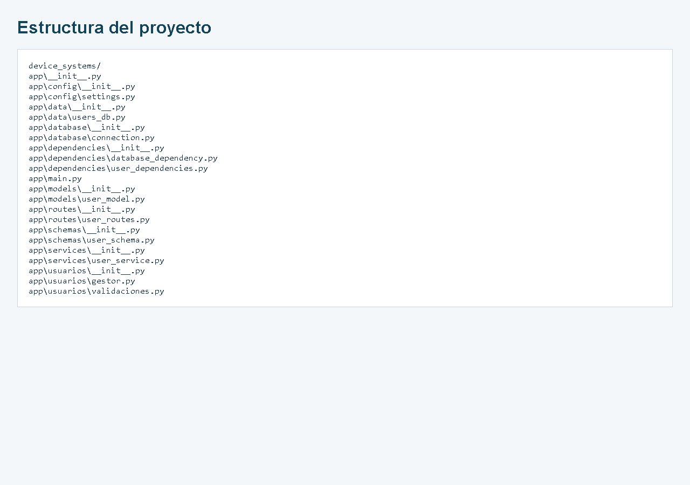

Los módulos anteriores de consola (`main.py` y `app/usuarios`) se
conservan como antecedentes; se ejecutan con `python main.py` desde la raíz del proyecto.
`app/data` conserva el almacenamiento histórico en memoria, que no utiliza la API.
El punto de entrada de esta API es **app.main:app**.
El respaldo `legacy_csharp/` se conserva localmente y está ignorado por Git.

## Arquitectura y persistencia

`connection.py` configura `engine`, `SessionLocal`, `Base` y `get_db()`.
`database_dependency.py` expone la sesión mediante `Depends(get_db)`.
Cada petición recibe una sesión que se cierra al terminar; las dependencias
anidadas de una misma petición comparten esa sesión gracias a FastAPI.
Las rutas delegan las consultas y transacciones en `user_service.py`.
Las escrituras utilizan `commit()` y hacen `rollback()` ante errores de integridad.

El **modelo SQLAlchemy** `User` representa la tabla `users`: columnas, tipos,
clave primaria, índices y restricciones. El **schema Pydantic** define el contrato
HTTP: valida el JSON de entrada y controla qué campos devuelve la API.
Un schema no crea tablas y un modelo ORM no sustituye la validación HTTP.
`UserResponse` utiliza `from_attributes=True` para leer objetos SQLAlchemy.

| Campo | Tipo SQLAlchemy | Restricciones |
| --- | --- | --- |
| id | Integer | Clave primaria autoincremental, no reutiliza IDs eliminados |
| name | String | NOT NULL; CHECK de al menos 3 caracteres tras trim |
| email | String | NOT NULL; UNIQUE con NOCASE en SQLite; índice |
| role | String | NOT NULL; CHECK admin, support o user |
| is_active | Boolean | NOT NULL; predeterminado True; CHECK booleano |
| created_at | DateTime | NOT NULL; fecha automática en UTC |

La fecha se almacena y devuelve sin desplazamiento de zona horaria; se interpreta
como UTC. PUT y PATCH conservan tanto el ID como la fecha de creación.
SQLite NOCASE compara sin mayúsculas/minúsculas los caracteres ASCII del correo.
El formato del correo se valida en Pydantic mediante `EmailStr`.

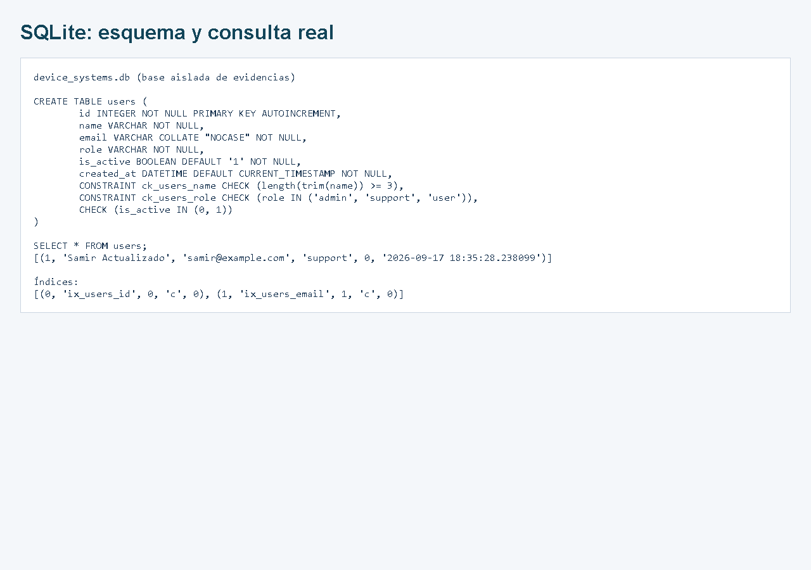

## Schemas y validaciones

- `UserCreate`: name, email y role obligatorios; is_active vale true si se omite.
- `UserUpdate`: PUT exige los cuatro campos editables.
- `UserPatch`: campos omitibles; rechaza null explícito y el objeto vacío.
- `UserResponse`: añade id y created_at, asignados por el servidor.

El nombre elimina espacios exteriores y requiere mínimo 3 caracteres.
Los roles admitidos son `admin`, `support` y `user`; un rol inválido genera 422.
No se admiten campos extra ni IDs o fechas proporcionados por el cliente.
Los correos duplicados generan 400, incluso ante inserciones concurrentes,
gracias a la restricción UNIQUE de la base de datos.

## Endpoints

| Método | Ruta | Resultado |
| --- | --- | --- |
| GET | /users | Lista, filtros y ordenamiento; 200 |
| GET | /users/{user_id} | Usuario por ID; 200 |
| POST | /users | Crea usuario; 201 |
| PUT | /users/{user_id} | Reemplaza todos los campos editables; 200 |
| PATCH | /users/{user_id} | Modifica campos enviados; 200 |
| DELETE | /users/{user_id} | Elimina; 204 sin cuerpo |

Ejemplos de consultas combinables:

```text
/users?role=support
/users?is_active=true
/users?role=admin&is_active=true&sort_by=name&order=asc
/users?sort_by=created_at&order=desc
```

`sort_by` admite `name` (predeterminado) o `created_at`; `order` admite `asc`
(predeterminado) o `desc`. Los empates se resuelven por ID ascendente.
El servicio también incluye `find_user_by_email()` para buscar por correo.

POST `/users`:

```json
{"name":"Samir Acosta","email":"samir@example.com","role":"user","is_active":true}
```

PUT `/users/1` (usa el ID devuelto por POST):

```json
{"name":"Samir Actualizado","email":"samir@example.com","role":"support","is_active":true}
```

PATCH `/users/1`:

```json
{"is_active":false}
```

## Errores controlados

| Código | Situación |
| --- | --- |
| 400 | Email duplicado o PATCH vacío |
| 404 | Usuario inexistente al consultar, actualizar o eliminar |
| 422 | Nombre/email/rol inválido, campos faltantes, null o parámetros inválidos |

Ejemplo: `{"detail":"Usuario no encontrado"}`.
Las actualizaciones con correo duplicado se rechazan antes de modificar campos.
La validación de roles ahora se realiza con Pydantic y devuelve 422.

## Configuración y documentación

La configuración existente admite `APP_NAME`, `APP_VERSION` y `ADMIN_USER` en
`.env`; consulta `.env.example`. `ADMIN_USER` no implementa autenticación.
El middleware conserva las cabeceras `X-App-Name` y `X-API-Version`.
Swagger incluye schemas, parámetros, descripciones y códigos HTTP.
Sus recursos visuales se cargan desde CDN y requieren Internet.


## Pruebas y evidencias

Desde la raíz, con el entorno virtual activo:

```powershell
.\.venv\Scripts\python.exe -m pytest -q
```

Resultado: **71 pruebas aprobadas**. Las pruebas usan archivos SQLite temporales,
incluyen CRUD, filtros, orden, errores, concurrencia, constraints y persistencia
al abrir un engine nuevo. No insertan datos de prueba en la base de trabajo.

Consulta el [informe histórico de reorganización](docs/evidencias/reorganizacion_backend.md),
el [informe de validación](docs/validacion.md), la
[guía de pruebas manuales](docs/pruebas_manuales.md), las
[respuestas HTTP completas](docs/resultados.json) y el
[informe HTML de evidencias](docs/evidencias.html).

Las siguientes imágenes son capturas de respuestas HTTP reales obtenidas con
Uvicorn y httpx, presentadas en un informe HTML. La captura de Swagger corresponde
a la interfaz real. La captura de base de datos muestra el esquema y la consulta
SQL de una base temporal aislada, antes de eliminar el usuario de prueba.

### Crear usuario: 201

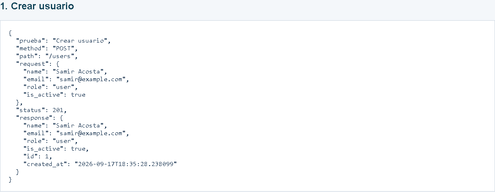

### Email repetido: 400

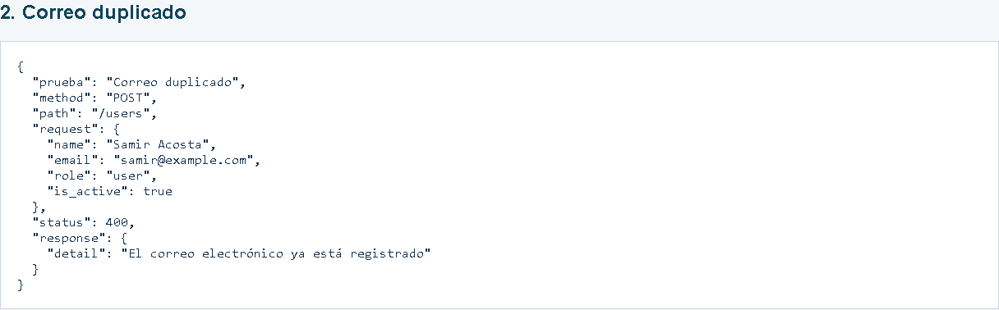

### Listar usuarios: 200

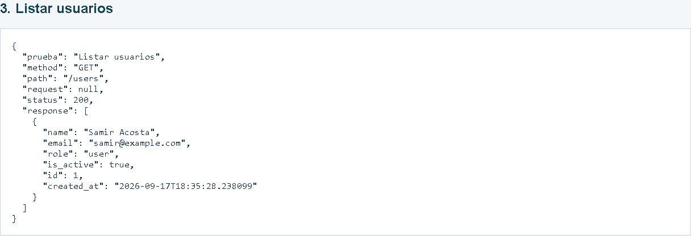

### Consultar por ID: 200

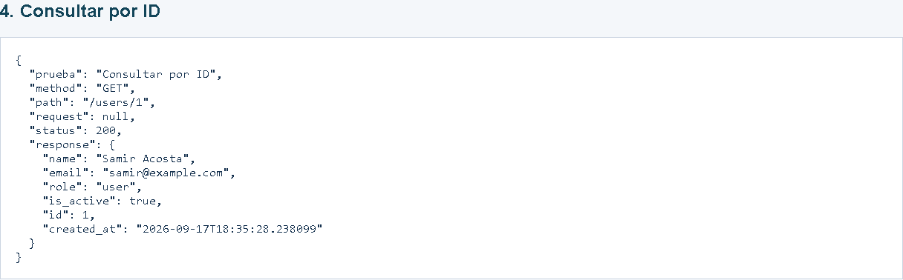

### Usuario inexistente: 404

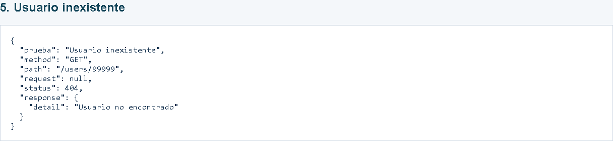

### Filtrar por rol: 200

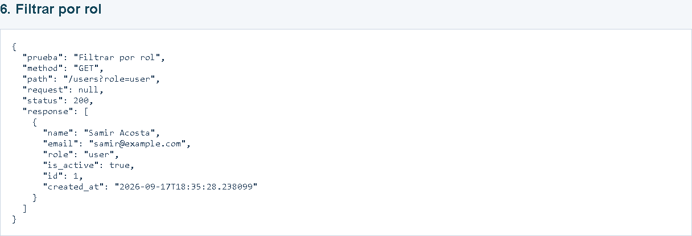

### Filtrar activos: 200

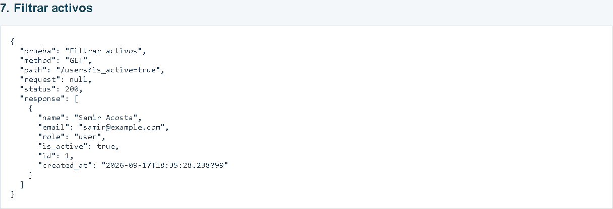

### Ordenar por fecha: 200

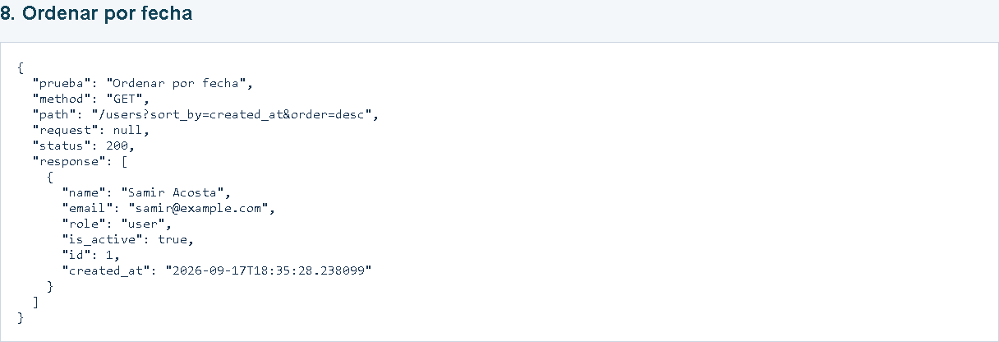

### PUT completo: 200

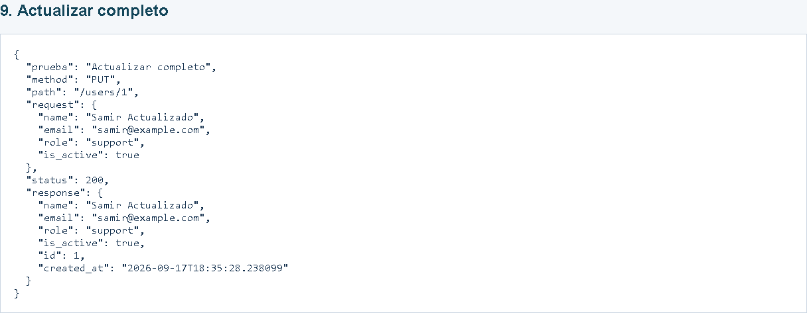

### PATCH parcial: 200

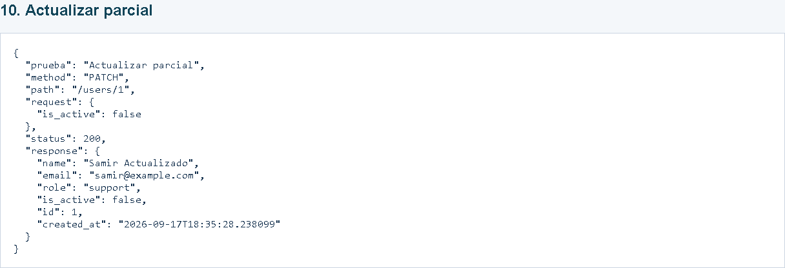

### Rol inválido: 422

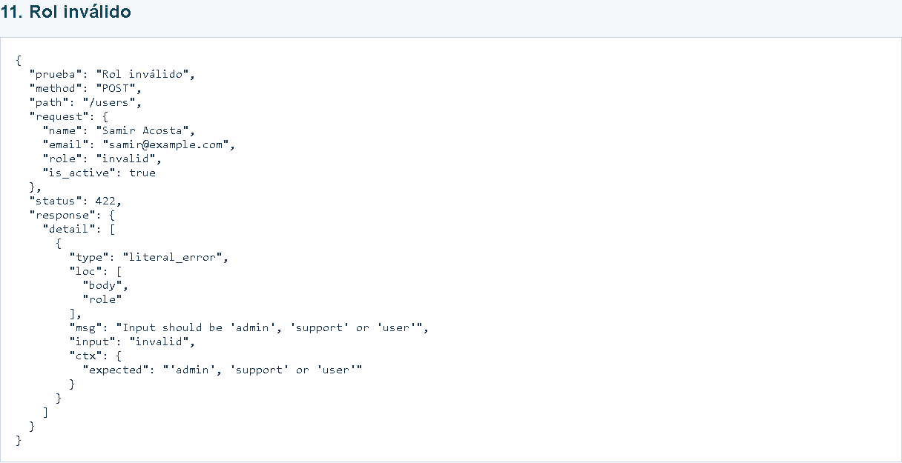

### Email inválido: 422

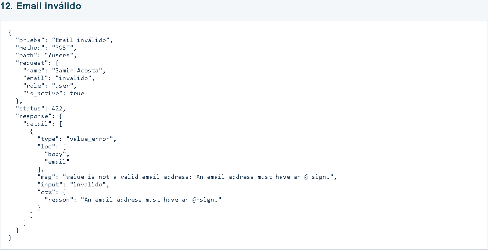

### Nombre inválido: 422

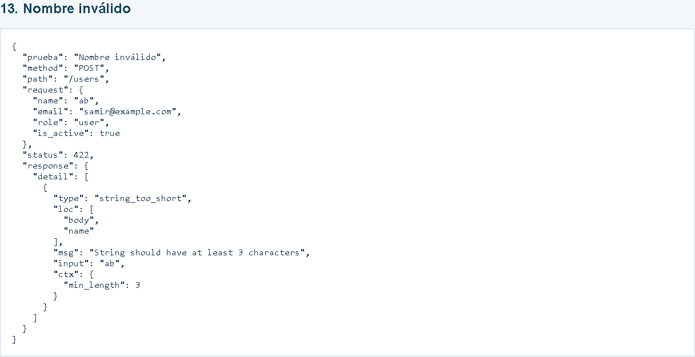

### DELETE: 204

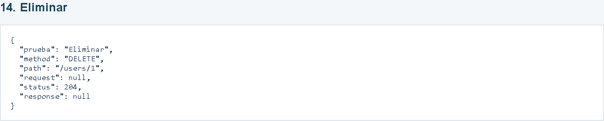

### Verificar eliminación: 404

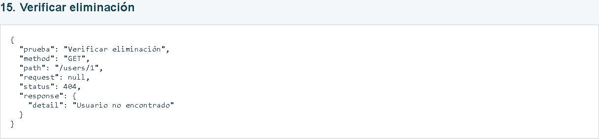

### Eliminar inexistente: 404

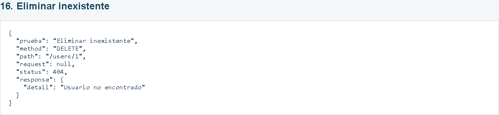

### Actualizar inexistente: 404

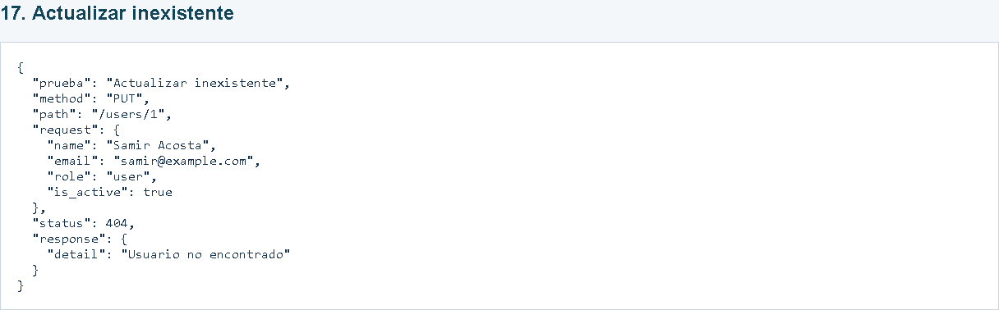

Para regenerar las evidencias con Microsoft Edge instalado:

```powershell
.\.venv\Scripts\python.exe -m pip install playwright
.\.venv\Scripts\python.exe docs/generar_evidencias.py
```

Playwright es una herramienta opcional para las capturas; no se requiere para
usar la API ni para ejecutar pytest. El generador inicia un servidor temporal,
comprueba los códigos HTTP, captura los resultados y cierra servidor y navegador.

## Reflexión final

La persistencia permite que los usuarios sigan disponibles después de reiniciar
el servidor. SQLAlchemy organiza las consultas con objetos Python y las
restricciones de SQLite protegen la integridad incluso fuera de la API.
Pydantic valida los datos antes de guardarlos y proporciona errores comprensibles
al cliente. Separar conexión, modelos, schemas, servicios y rutas facilita probar
y mantener la aplicación. Las transacciones evitan guardar cambios incompletos,
y las pruebas de reapertura comprueban que la persistencia es real.
