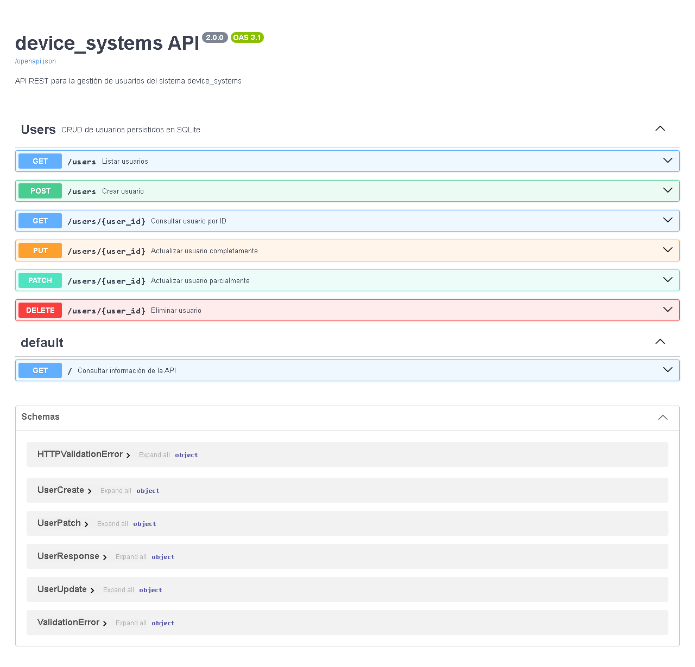

# device_systems

## Descripción

API REST para gestionar usuarios mediante un CRUD completo: crear, consultar,
reemplazar, actualizar parcialmente y eliminar. Incluye filtros, validación de
datos, manejo de errores y documentación interactiva para la actividad del SENA.

El proyecto principal es Python/FastAPI y se ejecuta desde esta raíz, aunque la
carpeta local todavía se llame `Usuario`. El ejercicio C# anterior se conservó
íntegro en `legacy_csharp/`, con sus archivos verificados mediante hashes. Ese
respaldo personal está excluido de Git para mantener la evidencia centrada en Python.

No hay base de datos real: los usuarios viven en una lista en memoria. Se restauran
al reiniciar el servidor o al recargar código con `--reload`. Ejecutar con un solo
proceso: varios workers tendrían colecciones independientes. No hay autenticación;
`ADMIN_USER` es una variable de configuración educativa, no una credencial.

## Tecnologías

- Python 3.10 o superior (verificado con Python 3.13).
- FastAPI, Uvicorn y Pydantic v2 con `EmailStr`/email-validator.
- python-dotenv para variables de entorno.
- Swagger/OpenAPI y ReDoc.
- pytest y httpx mediante `fastapi.testclient.TestClient`.

## Estructura del proyecto

```text
device_systems/                 # Raíz actual del espacio de trabajo
├── app/
│   ├── __init__.py
│   ├── main.py
│   ├── config/
│   │   ├── __init__.py
│   │   └── settings.py
│   ├── routes/
│   │   ├── __init__.py
│   │   └── user_routes.py
│   ├── schemas/
│   │   ├── __init__.py
│   │   └── user_schema.py
│   ├── services/
│   │   ├── __init__.py
│   │   └── user_service.py
│   ├── dependencies/
│   │   ├── __init__.py
│   │   └── user_dependencies.py
│   └── data/
│       ├── __init__.py
│       └── users_db.py
├── tests/
│   └── test_users.py
├── docs/
│   ├── pruebas_manuales.md
│   ├── validacion.md
│   └── images/
│       └── .gitkeep
├── legacy_csharp/              # Respaldo local, ignorado por Git
├── .env.example
├── .gitignore
├── pytest.ini
├── requirements.txt
└── README.md
```

`routes` recibe peticiones y llama servicios; `schemas` valida entradas y define
salidas; `services` aplica reglas de negocio; `dependencies` resuelve usuarios;
`data` guarda la colección; `config` carga el entorno. `main.py` configura la API,
registra el router, agrega cabeceras y expone la ruta raíz.

## Instalación

Desde la raíz del proyecto:

```bash
python -m venv .venv
```

Windows (PowerShell):

```powershell
.\.venv\Scripts\Activate.ps1

Api 
uvicorn app.main:app --reload

```

Windows (CMD):

```bat
.venv\Scripts\activate.bat
```

Linux/macOS:

```bash
source .venv/bin/activate
```

Con el entorno activado:

```bash
python -m pip install -r requirements.txt
```

Si PowerShell restringe la activación, se puede utilizar directamente
`.\.venv\Scripts\python.exe -m pip install -r requirements.txt`, sin cambiar
políticas del sistema.

## Flujo de trabajo con Git Flow

El proyecto utiliza las ramas `main` y `develop`. Las nuevas funcionalidades se desarrollan en ramas `feature/*` y posteriormente se integran en `develop`.

## Variables de entorno

La aplicación funciona sin crear `.env`. Opcionalmente copia `.env.example` a
`.env` y ajusta sus valores locales:

```dotenv
APP_NAME=device_systems
APP_VERSION=2.0.0
ADMIN_USER=admin
```

`app/config/settings.py` usa `load_dotenv()` y conserva los valores ya definidos
en el entorno. Si faltan o están vacíos, utiliza los valores seguros anteriores.
`APP_NAME` y `APP_VERSION` configuran los metadatos, la ruta raíz y las cabeceras.
`ADMIN_USER` se puede consultar como `settings.ADMIN_USER`; no implementa login.
`.env` está ignorado por Git. No agregues información privada a `.env.example`.

## Ejecutar API

Con el entorno activado y ubicado en la raíz:

```bash
uvicorn app.main:app --reload
```

También puedes ejecutar sin activar el entorno en Windows:

```powershell
.\.venv\Scripts\python.exe -m uvicorn app.main:app --reload
```

`GET http://127.0.0.1:8000/` responde:

```json
{"app": "device_systems", "version": "2.0.0", "docs": "/docs"}
```

## Abrir documentación

- Swagger: http://127.0.0.1:8000/docs
- ReDoc: http://127.0.0.1:8000/redoc
- OpenAPI JSON: http://127.0.0.1:8000/openapi.json

## Tabla de endpoints

| Método | Endpoint | Descripción | Código exitoso |
| --- | --- | --- | --- |
| GET | `/` | Información de la API | 200 |
| GET | `/users` | Listar y filtrar usuarios | 200 |
| GET | `/users/{user_id}` | Consultar usuario | 200 |
| POST | `/users` | Crear usuario | 201 |
| PUT | `/users/{user_id}` | Actualizar completamente | 200 |
| PATCH | `/users/{user_id}` | Actualizar parcialmente | 200 |
| DELETE | `/users/{user_id}` | Eliminar usuario | 204 |

Filtros opcionales, combinables:

```text
GET /users?role=admin
GET /users?role=support
GET /users?is_active=true
GET /users?is_active=false
GET /users?role=admin&is_active=true
```

Un resultado sin coincidencias devuelve `[]` con 200. Un rol de filtro no
permitido devuelve 400 y un booleano inválido devuelve 422.

## Modelos y validaciones

- `UserBase`: campos comunes. `name` elimina espacios exteriores y exige al menos
  tres caracteres. `email` usa `EmailStr`; `is_active` es booleano.
- `UserCreate`: requiere `name`, `email` y `role`; `is_active` vale `true` si se omite.
- `UserUpdate`: exige los cuatro campos editables para PUT.
- `UserPatch`: permite omitir cualquier campo, pero no acepta `null` explícito.
  `model_dump(exclude_unset=True)` entrega únicamente los campos enviados,
  incluyendo `false`. El objeto vacío produce 400.
- `UserResponse`: añade `id`, generado por el servidor. Enviar `id` o campos
  desconocidos en POST/PUT/PATCH produce 422.

Los roles permitidos son **admin, support y user**, centralizados en
`ALLOWED_ROLES` dentro del servicio. Se validan como regla de negocio, por eso un
rol de texto no permitido devuelve **400**, no 422. Otros tipos inválidos siguen
las validaciones de Pydantic.

El correo no se puede repetir, ignorando mayúsculas/minúsculas. PUT y PATCH
permiten conservar el correo propio y rechazan el de otro usuario. Las reglas
se comprueban antes de modificar datos, de modo que una operación rechazada no
deja cambios parciales.

Hay tres usuarios iniciales: administrador (ID 1), soporte (ID 2) y usuario
inactivo (ID 3). Un contador genera IDs sin reutilizar los eliminados durante la
ejecución. Un lock protege las escrituras y la comprobación del correo ante
peticiones concurrentes dentro del mismo proceso.

## Ejemplos JSON

POST `/users`:

```json
{
  "name": "Samir Acosta",
  "email": "samir@example.com",
  "role": "user",
  "is_active": true
}
```

PUT `/users/{user_id}` (usa el ID que devolvió POST):

```json
{
  "name": "Samir Acosta Peña",
  "email": "samir@example.com",
  "role": "support",
  "is_active": true
}
```

PATCH `/users/{user_id}`:

```json
{
  "role": "support"
}
```

## Códigos HTTP

| Código | Significado en esta API |
| --- | --- |
| 200 | Consulta o actualización exitosa |
| 201 | Usuario creado |
| 204 | Usuario eliminado; sin cuerpo de respuesta |
| 400 | Correo duplicado, rol no permitido o PATCH vacío |
| 404 | Usuario inexistente |
| 422 | Datos, campos requeridos o parámetros inválidos |

## Manejo de errores

`HTTPException` interrumpe la operación y devuelve un código HTTP con `detail`.
Por ejemplo, consultar un usuario inexistente devuelve 404:

```json
{"detail": "Usuario no encontrado"}
```

Reglas de negocio, todas con 400:

```json
{"detail": "El correo electrónico ya está registrado"}
```

```json
{"detail": "Rol no permitido"}
```

```json
{"detail": "Debe enviar al menos un campo para actualizar"}
```

FastAPI genera automáticamente el 422 con una lista de errores que identifica
los campos incorrectos; no lo capturamos manualmente.

## Dependency Injection

`get_user_or_404(user_id: int)` busca el usuario mediante el servicio, retorna sus
datos o lanza 404. Las rutas GET por ID, PUT, PATCH y DELETE reciben el resultado
mediante `Depends(get_user_or_404)`, declarado en el alias `ExistingUser`.
Así FastAPI ejecuta la dependencia antes de la ruta y evita repetir la misma
búsqueda y validación en cada endpoint. Las pruebas también sustituyen esta
dependencia para comprobar que realmente se está utilizando.

## Cabeceras HTTP

Un middleware agrega estas cabeceras a las respuestas normales y a los errores
controlados 400, 404 y 422, sin repetirlas en cada ruta:

```text
X-App-Name: device_systems
X-API-Version: 2.0.0
```

Sus valores provienen de la configuración. También están presentes en DELETE 204.

## Swagger/OpenAPI

Swagger permite explorar esquemas, campos obligatorios y respuestas, y ejecutar
las peticiones con **Try it out**. Los seis endpoints de usuarios aparecen bajo
`Users`, con nombres y descripciones en español. ReDoc presenta una vista de
consulta de la misma especificación OpenAPI. Los recursos visuales de estas
interfaces se cargan desde sus CDN predeterminadas, por lo que el navegador
necesita conexión a Internet.

Referencias oficiales utilizadas: [dependencias de FastAPI](https://fastapi.tiangolo.com/tutorial/dependencies/),
[middleware](https://fastapi.tiangolo.com/tutorial/middleware/) y
[pruebas con TestClient](https://fastapi.tiangolo.com/tutorial/testing/).

## Pruebas funcionales

Con el entorno activado:

```bash
python -m pytest -q
```

También funciona `pytest`. En Windows sin activar el entorno:

```powershell
.\.venv\Scripts\python.exe -m pytest -q
```

Las pruebas cubren CRUD, filtros individuales y combinados, errores 400/404/422,
actualización parcial, IDs, concurrencia, cabeceras, dependencia y documentación.
Una fixture restaura la colección y el contador antes y después de cada prueba.
No es necesario levantar Uvicorn para utilizar TestClient.

Consulta la [secuencia completa de 14 pruebas manuales](docs/pruebas_manuales.md)
con JSON exactos y respuestas esperadas para Swagger.

Resultado de la ejecución: **58 pruebas aprobadas**. Consulta el
[informe de validación](docs/validacion.md) para las versiones verificadas, los
dos avisos de dependencias, la comprobación HTTP con Uvicorn y el estado de Git.

## Evidencias

Las capturas todavía no se han creado. Guarda capturas reales de tu ejecución
en `docs/images/` con los nombres indicados; los marcadores se mostrarán cuando
agregues las imágenes. `.gitkeep` conserva la carpeta vacía.

### Evidencia Swagger UI



### Evidencia ReDoc


### Pruebas de endpoints

Agrega aquí capturas de POST 201, PUT/PATCH 200, DELETE 204, filtros y errores.
Puedes nombrarlas `docs/images/post-201.png`, `docs/images/patch-200.png` y
`docs/images/error-404.png`. Incluye también una captura de `pytest` ejecutado.

## Reflexión final

La evolución de esta actividad permitió pasar de la idea de una API básica con
GET y POST a una API REST más completa. En este espacio fue necesario reconstruir
la base porque el ejercicio disponible estaba hecho en C#. Al implementar el
CRUD entendí mejor cuándo usar PUT y PATCH, cómo responder con códigos HTTP y
cómo manejar errores sin detener la aplicación. Con `Depends()` pude reutilizar
la búsqueda de usuarios, y Swagger me facilitó probar lo que construí. Separar
las responsabilidades en rutas, modelos y servicios también hizo que el código
fuera más fácil de leer y corregir.
